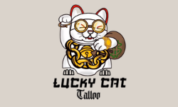

<!--
*** Thanks for checking out the Best-README-Template. If you have a suggestion
*** that would make this better, please fork the repo and create a pull request
*** or simply open an issue with the tag "enhancement".
*** Don't forget to give the project a star!
*** Thanks again! Now go create something AMAZING! :D
-->

[![LinkedIn][linkedin-shield]][linkedin-url]

<!-- PROJECT LOGO -->
 

  

<h3 align="center">LuckyCat Tattoo Portfolio App</h3>

  

Personal portfolio project app for up and coming Tattoo Artist. 
     
    <a href="https://github.com/PPableo/luckycat-tattoo-paulPableoProject1"><strong>Explore the docs »</strong></a>
     
     
    <a href="https://pabloproject2.netlify.app/">View Demo</a>
    ·
    <a href="https://github.com/PPableo/luckycat-tattoo-paulPableoProject1/issues">Report Bug</a>
    ·
    <a href="https://github.com/PPableo/luckycat-tattoo-paulPableoProject1/issues">Request Feature</a>
  

<!-- TABLE OF CONTENTS -->

  
Table of Contents

  <ol>
    <li>
      <a href="#about-the-project">About The Project</a>
      <ul>
        <li><a href="#built-with">Built With</a></li>
      </ul>
    </li>
    <li><a href="#usage">Usage</a></li>
    <li><a href="#roadmap">Roadmap</a></li>
    <li><a href="#contact">Contact</a></li>
    <li><a href="#acknowledgments">Acknowledgments</a></li>
  </ol>

<!-- ABOUT THE PROJECT -->
## About The Project

[![Product Name Screen Shot][product-screenshot]](https://pabloproject2.netlify.app/)

### Built With

* [![HTML5][HTML5.js]][HTML-url]
* [![SASS][SASS.js]][SASS-url]
* [![React][React.js]][React-url]

(<a href="#readme-top">back to top</a>)

<!-- USAGE EXAMPLES -->
## Usage

Personal Portfolio/Design - A responsive portfolio design to match Client Style/Art

About - Story/Work

Contact Form - Booking, and Contact

_For more examples, please refer to the [Documentation](https://example.com)_

(<a href="#readme-top">back to top</a>)

<!-- ROADMAP -->
## Roadmap

- [ ] Contact Form
- [ ] About Page
- [ ] Booking System
    - [ ] Calendly

See the [open issues](https://github.com/PPableo/luckycat-tattoo-paulPableoProject1/issues) for a full list of proposed features (and known issues).

(<a href="#readme-top">back to top</a>)

<!-- CONTACT -->
## Contact

https://paulpableo.com/

Project Link: [https://github.com/PPableo/luckycat-tattoo-paulPableoProject1](https://github.com/PPableo/luckycat-tattoo-paulPableoProject1)

(<a href="#readme-top">back to top</a>)

<!-- ACKNOWLEDGMENTS -->
## Acknowledgments

* [Luckycat Tattoo](https://www.instagram.com/luckycat.tattoo/)
* [Codegrid](https://github.com/codegridweb)

(<a href="#readme-top">back to top</a>)

<!-- MARKDOWN LINKS & IMAGES -->
<!-- https://www.markdownguide.org/basic-syntax/#reference-style-links -->
[contributors-shield]: https://img.shields.io/github/contributors/github_username/luckycat-tattoo-paulPableoProject1.svg?style=for-the-badge
[contributors-url]: https://github.com/PPableo/luckycat-tattoo-paulPableoProject1/graphs/contributors
[issues-shield]: https://img.shields.io/github/issues/PPableo/luckycat-tattoo-paulPableoProject1.svg?style=for-the-badge
[issues-url]: https://github.com/PPableo/luckycat-tattoo-paulPableoProject1/issues
[linkedin-shield]: https://img.shields.io/badge/-LinkedIn-black.svg?style=for-the-badge&logo=linkedin&colorB=555
[linkedin-url]: https://linkedin.com/in/paulpableo
[product-screenshot]: images/screenshot.png
[HTML5.js]: https://img.shields.io/badge/HTML-E34F26?style=for-the-badge&logo=html5&logoColor=white
[HTML-url]: https://developer.mozilla.org/en-US/docs/Glossary/HTML5/
[React.js]: https://img.shields.io/badge/React-20232A?style=for-the-badge&logo=react&logoColor=61DAFB
[React-url]: https://reactjs.org/
[SASS.js]: https://img.shields.io/badge/SASS-CC6699?style=for-the-badge&logo=SASS&logoColor=white
[SASS-url]: https://sass-lang.com/
